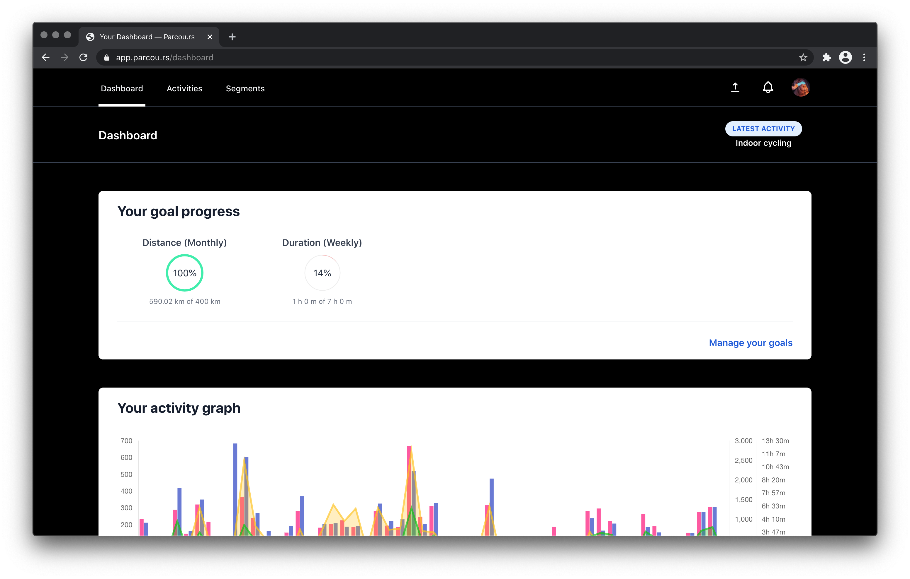
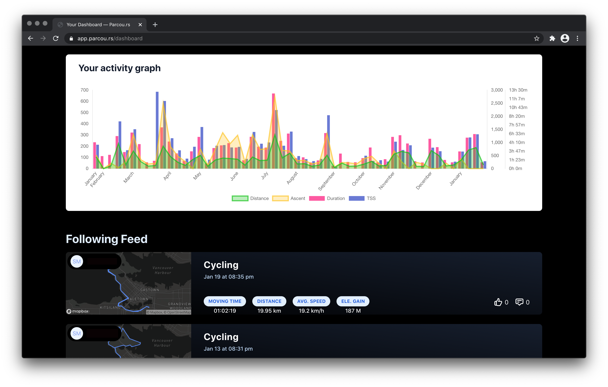
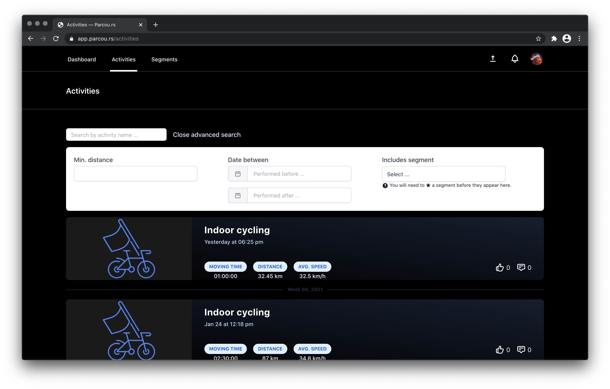
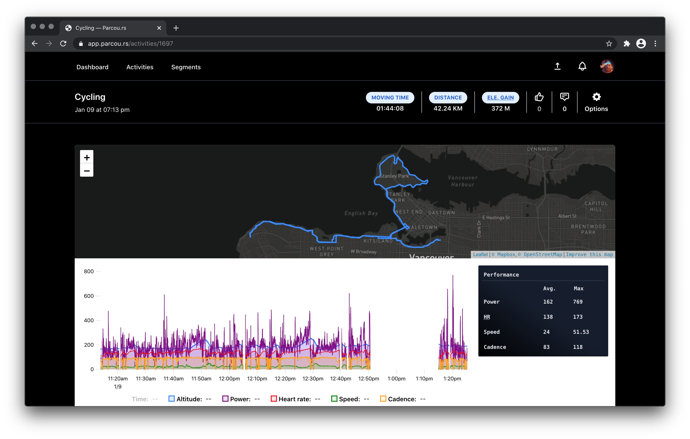
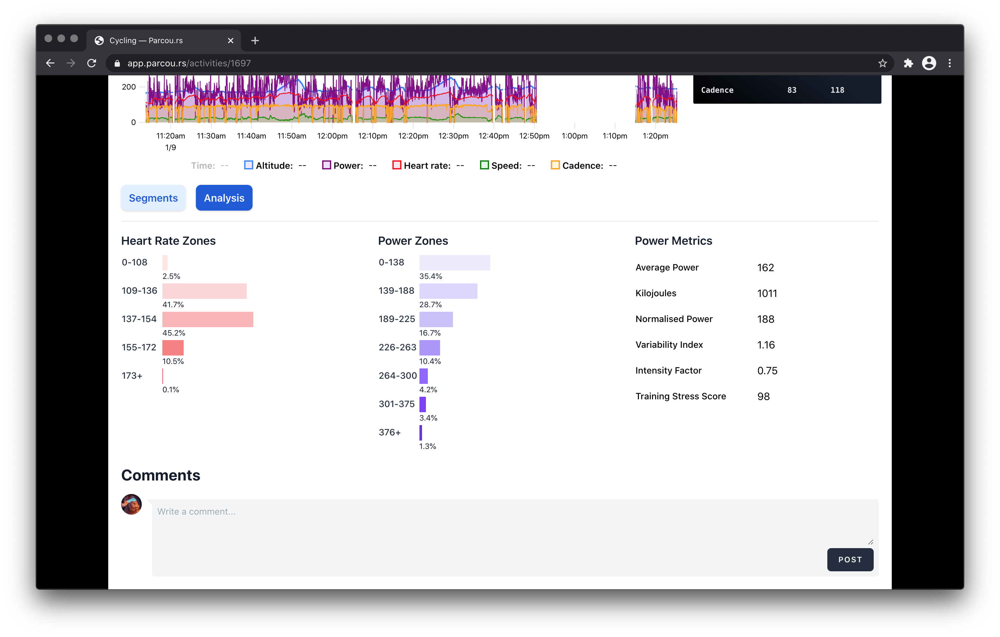
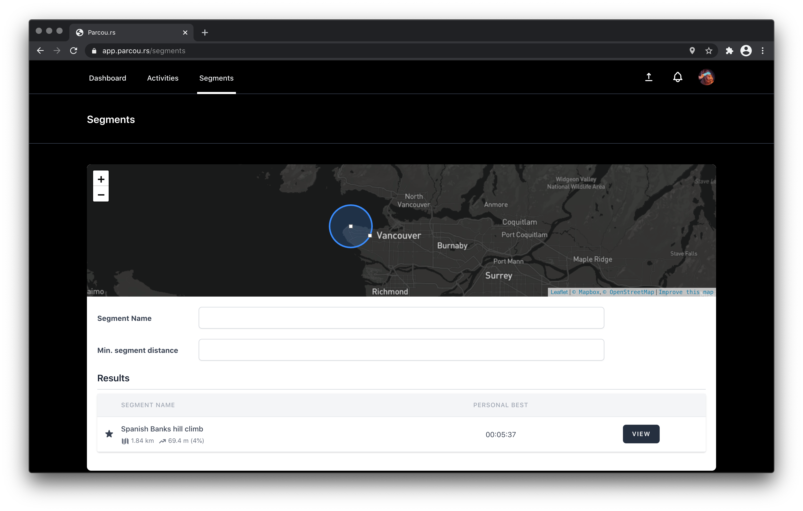
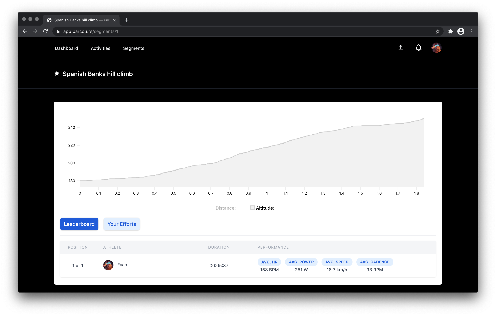

# Introducing Parcours

Parcours is an implementation of the best parts of [Strava](https://strava.com).

1. Automatic ride activity importing from Garmin & Wahoo
2. Essential activity tracking, mapping of your rides
3. Performance analysis, including power and heart rate zones, drilling down on time ranges
4. Segments and leaderboards
5. Personal goal tracking
6. Social networking with comments and likes

## Why though?

Developing Parcours was a learning experience for PostgreSQL/PostGIS, mapping of GeoJSON, parsing/graphing/visualization of sensor data.

## What does it look like?

### Dashboard

### Dashboard activty graph and feed

### Your Activities

### Activity

### Activity analysis

### Segments

### Segment view
